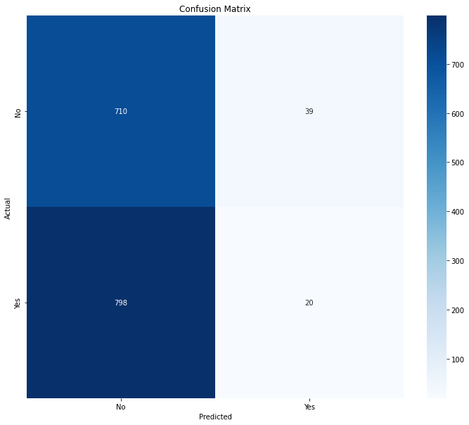
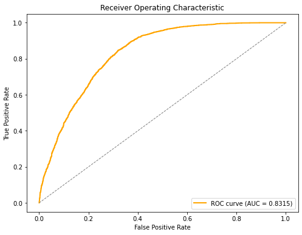

# version-cv

* **One Sentence Summary** 

  This repository symbolic math classification using image-based, text-based, and classical learning models including EfficientNetB0, GPT2, Word2Vec, and XGBoost.

---

## Overview

* **Definition of the tasks / challenge** 
  The project explores symbolic reasoning and multimodal classification using visual and textual inputs. A binary classification task was constructed using the Hugging Face version of the MathWriting dataset by shuffling LaTeX ID and image pairings to generate synthetic binary labels (0 or 1).

* **Approach** 
  Four models were developed and compared:
  - `EfficientNetB0` for visual symbol classification
  - `GPT2` fine-tuned on LaTeX token sequences
  - `Word2Vec` for symbolic embeddings
  - `XGBoost` applied to Word2Vec vectors

* **Summary of the performance achieved** 
  - EfficientNetB0: ~51% accuracy 
  - GPT2: ~47% accuracy 
  - Word2Vec: ~48% macro F1 score 
  - XGBoost: ~49% macro F1 score 
  - GPT2 prototype: ~76.1% accuracy, ROC AUC score .832 (83.2%)

---

## Summary of Workdone

### Data

* **Data:**
  * **Type:**
    - Image: 224×224 LaTeX-rendered symbols (PNG)
    - Text: Tokenized LaTeX expressions
    - Output: Multi-class and binary labels
  * **Size:**
    - ~4,000 total samples (multi-class)
    - ~2,000 binary samples from MathWriting
  * **Split:**
    - Multi-class: 2800 train / 600 test / 600 val 
    - Binary: 1600 train / 200 test / 200 val

#### Preprocessing / Clean up

* Image resizing and normalization 
* GPT2 tokenization of LaTeX strings 
* Shuffling LaTeX ID–image pairs to generate 0/1 binary labels 
* Oversampling used for class balancing

#### Data Visualization

* Token length distributions, symbol histograms 
* t-SNE clustering of Word2Vec vectors 
* Confusion matrices and ROC curves for binary task

### Problem Formulation

* **Input / Output:** 
  - Input: math symbol image or LaTeX sequence 
  - Output: categorical label or binary label

* **Models:** 
  - `EfficientNetB0` (image classifier) 
  - `GPT2` (LaTeX sequence transformer) 
  - `Word2Vec` + `XGBoost` (vectorized + classical)

* **Loss, Optimizer, Hyperparameters:** 
  - Loss: Categorical/Binary Crossentropy 
  - Optimizers: Adam, AdamW 
  - Batch Size: 32, Epochs: 30, Early stopping applied

---

### Training

* **Software & Hardware:** 
  - Python 3.12.11 
  - TensorFlow 2.15, 2.18, and 2.19, HuggingFace Transformers, Gensim, XGBoost 
  - Trained on: Dell Precision Workstation 5510, Lambda Cloud compute - NVIDIA RTX A6000, NVIDIA Quadro RTX 6000, NVIDIA GH200 Grace Hopper Superchip, NVIDIA A100 Tensor Core GPU, and NVIDIA A10 Tensor Core GPU 

* **Training time:** 

  - Full training, tuning, and experimentation across all models took a couple of weeks 1-2.

* **Training curves:** 

  - Models converged within 10–20 epochs 
  - Validation monitoring and checkpointing used 
  - Binary classifier reached high AUC after 5–8 epochs

* **Challenges:** 

  - GPT2 token memory and batch size constraints 
  - Symbol label imbalance and binary class noise 
  - Feature drift during Word2Vec–XGBoost transfer
  - Scoping the work only to what is understood as data science today


### Performance Comparison

* **Metrics:** Accuracy, Macro F1, ROC AUC (binary)

| Model                  | Accuracy | F1 Score (macro) |
|-----------------------|----------|------------------|
| EfficientNetB0        | 51%      | NaN              |
| GPT2                  | 47%      | 0.34             |
| Word2Vec              | 48%      | 0.32             |
| XGBoost               | 49%      | 0.48             |
| GPT2 Prototype        | 76.1%    | 0.76             |

---

* **Visualizations:** 
   
   
  

---

### Conclusions

* EfficientNetB0 was optimal for symbolic image classification 
* GPT2 achieved strong results for token sequence inputs 
* MathWriting binary label task showed robust generalization from shuffled samples 
* Word2Vec + XGBoost was lightweight and interpretable
* GPT2 prototype outperformed all model builds (was not fully built)

---

### Future Work

* Integrate CROHME-style handwritten data 
* Explore layout-aware ViT + LSTM hybrids 
* Build MathOCR pipeline with MathPix-style parsing 
* Expand symbolic corpora beyond MathWriting
* Explainable AI (XAI)
* Secure ML/DL systems
* Responsible data science

---

## How to reproduce results

```bash
git clone https://github.com/rcghpge/version-cv.git
cd version-cv
pixi install  # Or: pip install -r requirements.txt
```

## Launch Jupyter Notebooks

```bash
jupyter notebook notebooks/
```

Notebook index:

 * `basemodel.ipynb`: basel model + EfficientNetB0 backbone model
 * `model2.ipynb`: GPT2 model
 * `model3.ipynb`: Word2Vec training + classical classifier
 * `model4.ipynb`: XGBoost integration
 * `mathwriting.ipynb`: prototyping builds
 * `comparemodels.ipynb`: side-by-side model analysis
 * `prototypes.ipynb`: GPT2 prototype (performed the best)

---

## Overview of files in repository

```bash
.
├── CITATION.cff              # Citation metadata
├── LICENSE                   # Open-source license
├── README.md                 # Main project documentation
├── assets/                   # Diagrams, plots, confusion matrices, LaTeX images
├── cloud/                    # LambdaCloud configs and scripts
├── data/                     # MathWriting, DeepMind MATH, CSAI, and related corpora
├── docs/                     # Academic PDFs and source papers
├── install_pixi.sh           # Environment setup script
├── logs/                     # Training and evaluation logs
├── models/                   # Saved model files (.h5, .keras, .json)
├── modules/                  # DataLoader and utility code
├── notebooks/                # All core modeling and evaluation notebooks
├── pixi.lock                 # Pixi environment lock
├── pixi.toml                 # Pixi environment definition
└── sandbox/                  # Experimental code (dev branch)
```

---

## Software Setup

```bash
# Preferred
pixi install

# Or use pip
pip install -r requirements.txt
```

Dependencies:

 * `tensorflow`==2.15, 2.18, 2.19
 * `transformers`
 * `gensim`
 * `xgboost`
 * `scikit-learn`, `matplotlib`, `numpy`, `pandas`
 * `pixi`
 * `python` >=3.12.11

---

## Data

* Public data:
  * [MathWriting Dataset](https://huggingface.co/datasets/deepcopy/MathWriting-human)
  * DeepMind MATH (local generation)
* Binary labels generated by shuffling MathWriting LaTeX IDs

Run preprocessing via:

```bash
jupyter notebook notebooks/<notebooks>.ipynb
```

---

## Training

All model training is notebook-based. Start with:

 * basemodel.ipynb for image classification
 * model2.ipynb for text modeling
 * model3.ipynb and model4.ipynb for classical approaches
 * protopes.ipynb for GPT-based designs

## Performance Evaluation

Use:
```bash
jupyter notebook notebooks/comparemodels.ipynb
```
To reproduce visualizations, metrics, and ROC plots.

---

## Citations

Tan & Le (2019). EfficientNet
Vaswani et al. (2017). Attention Is All You Need
Mikolov et al. (2013). Word2Vec
Chen & Guestrin (2016). XGBoost
Gervais et al. (2025). MathWriting Dataset
Hendrycks et al. (2021). MATH Dataset
Cocker, R. (2025). Version-Tab (Version 0.1.0) [Computer software]. https://github.com/rcghpge/version-tab

---
